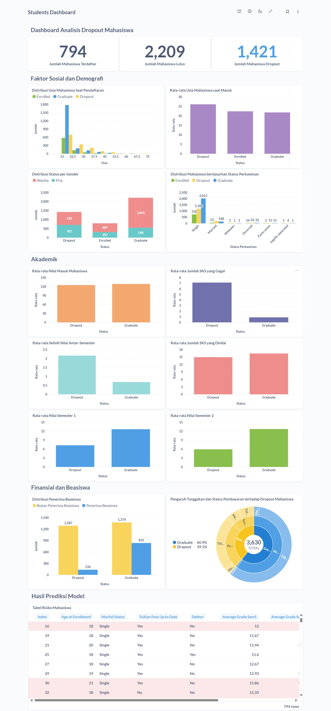

# Student Dropout Analysis – Jaya Jaya Institut

Analisis data dropout mahasiswa di Jaya Jaya Institut menggunakan pendekatan data science untuk menemukan faktor-faktor utama penyebab mahasiswa keluar dari perkuliahan dan merancang rekomendasi berbasis data.

## 🧠 Business Understanding

Jaya Jaya Institut merupakan salah satu institusi pendidikan perguruan yang telah berdiri sejak tahun 2000. Hingga saat ini ia telah mencetak banyak lulusan dengan reputasi yang sangat baik. Akan tetapi, terdapat banyak juga siswa yang tidak menyelesaikan pendidikannya alias dropout. Dropout mahasiswa merupakan masalah serius yang berdampak pada institusi dari segi reputasi, akreditasi, dan efisiensi operasional.

### Permasalahan Bisnis
- Mahasiswa yang dropout dapat mempengaruhi reputasi institusi dan akreditasi.
- Biaya operasional yang tidak efisien karena sumber daya telah dialokasikan untuk mahasiswa yang tidak menyelesaikan studi.
- Belum adanya sistem yang memadai untuk memprediksi mahasiswa yang berisiko tinggi dropout.
- Kurangnya pemahaman tentang faktor-faktor yang mempengaruhi keputusan mahasiswa untuk dropout.

### Cakupan Proyek
Cakupan proyek ini adalah:
- Mengumpulkan mengolah data mahasiswa.
- Melakukan analisis data untuk menemukan pola dan faktor penyebab dropout.
- Membangun model prediksi untuk mengidentifikasi mahasiswa yang berisiko tinggi dropout.
- Membuat dashboard visual untuk memantau faktor-faktor yang berhubungan dengan dropout.
- Memberikan rekomendasi tindakan untuk mengurangi dropout.

## 🧪 Proses Data Science

### 1. Business Understanding  
Memahami permasalahan dropout di institusi pendidikan.

### 2. Data Understanding  
Menelusuri struktur, tipe data, dan distribusi atribut yang diberikan.

### 3. Data Preparation  
* Encoding label
* Feature engineering: `Academic_consistency`, `Total_failed_units`, `Total_evaluations`
* Normalisasi numerik dengan StandardScaler

### 4. Exploratory Data Analysis (EDA)  
Menggunakan visualisasi `Plotly` untuk menelusuri:
* Korelasi antar fitur numerik
* Distribusi data kategorikal dan numerik
* Analisis multivariat

### 5. Modeling  
Melatih dua model klasifikasi:  
* Logistic Regression
* Random Forest

### 6. Evaluation  
Evaluasi model menggunakan:
* Accuracy
* Precision
* Recall
* F1-Score
* Confusion Matrix
* ROC Curve

## 💻 Cara Menjalankan Proyek

### 1. Clone Repository & Unduh Dataset  
Jalankan perintah berikut di terminal untuk mengunduh repository dan dataset:
```bash
git clone https://github.com/alfikiafan/student-dropout-analysis.git
cd student-dropout-analysis
```

Dataset dapat diunduh dari tautan berikut:  
https://github.com/dicodingacademy/dicoding_dataset/tree/main/students_performance

### 2. Siapkan Virtual Environment (Opsional)  
Jalankan perintah berikut di terminal untuk membuat virtual environment:
```bash
python -m venv env
source env/bin/activate  # Untuk Linux/macOS
env\Scripts\activate     # Untuk Windows
```

### 3. Instalasi Requirements  
Jalankan perintah berikut di terminal untuk menginstal semua dependensi yang diperlukan:
```bash
pip install -r requirements.txt
```

### 4. Jalankan Notebook untuk Eksplorasi & Pelatihan Model  
Buka file `notebook.ipynb` di Jupyter Notebook atau Google Colab untuk eksplorasi data dan pelatihan model.

### 5. Jalankan Prediksi Model (Streamlit)  
Untuk menjalankan aplikasi prediksi model, gunakan Streamlit. Pastikan Anda sudah menginstal Streamlit dengan perintah:  
```bash
pip install streamlit
```
Kemudian jalankan aplikasi dengan perintah:
```bash
streamlit run app.py
```
Anda juga bisa mengakses aplikasi prediksi di  
https://alfikiafan-student-dropout-analysis.streamlit.app/

## 📊 Dashboard Metabase

### File:
* `metabase.db.mv.db` (database Metabase H2)  
* **Link:** http://localhost:3000/public/dashboard/4226c90a-983f-48e9-9e4d-573841f5cf94

### Cara Menjalankan Metabase:  
1. Pastikan Anda sudah menginstal Docker di sistem Anda. Jika belum, silakan ikuti petunjuk instalasi Docker sesuai dengan sistem operasi yang Anda gunakan.  
2. Unduh Metabase dari [https://www.metabase.com/start](https://www.metabase.com/start)
3. Jalankan Metabase dan koneksikan ke file database (`metabase.db.mv.db`) menggunakan Docker.

Kemudian akses dashboard di [http://localhost:3000](http://localhost:3000)

### 📸 Screenshot



## Conclusion

1. Mahasiswa yang memiliki **nilai ujian penerimaan** dan **nilai mata kuliah semester 1** yang rendah lebih rentan untuk **dropout**. Hal ini menunjukkan bahwa **kinerja akademik yang buruk** pada tahap awal perkuliahan sering kali berhubungan dengan keputusan untuk keluar dari pendidikan atau dikeluarkan oleh kampus.

2. **Mahasiswa yang lebih tua** pada saat pendaftaran memiliki kecenderungan **dropout** yang lebih tinggi. Tantangan tambahan yang mereka hadapi, baik dari segi tanggung jawab pribadi atau masalah kesehatan, bisa memengaruhi kemampuan mereka untuk bertahan di perguruan tinggi.

3. Mahasiswa yang **memiliki kebutuhan pendidikan khusus** lebih cenderung **dropout**. Faktor-faktor seperti kurangnya dukungan yang sesuai dan kesulitan dalam mengakses pendidikan yang inklusif bisa saja menjadi penghambat bagi mereka untuk terus melanjutkan studi.

4. Mahasiswa yang **tidak tertib dalam pembayaran uang kuliah** lebih cenderung **dropout**. Dari sini terlihat kalau **kesulitan finansial** dapat mempengaruhi keputusan untuk melanjutkan studi. **Penerima beasiswa** memiliki tingkat **dropout** yang lebih rendah karena mereka terbantu secara finansial.

5. Faktor eksternal seperti **ekonomi makro** tidak berpengaruh langsung  
   Berdasarkan data yang ada, faktor **ekonomi makro** (seperti inflasi atau PDB) negara asal mahasiswa tidak menunjukkan korelasi yang signifikan dengan **performa akademik individu** atau **keputusan dropout**. Oleh karena itu, meskipun kondisi ekonomi global atau nasional dapat mempengaruhi aspek lain, dalam konteks ini mereka tidak terlalu berdampak langsung pada keputusan individu untuk melanjutkan pendidikan atau tidak.

### Rekomendasi Action Items
Berikan beberapa rekomendasi action items yang harus dilakukan perusahaan guna menyelesaikan permasalahan atau mencapai target mereka.
- Sediakan program bimbingan atau pelatihan keterampilan akademik untuk mahasiswa yang kesulitan di awal kuliah.
- Pastikan fasilitas kampus dapat diakses dengan mudah dan tawarkan layanan konseling khusus untuk mereka.
- Perbanyak program beasiswa dan fleksibilitas pembayaran uang kuliah agar mahasiswa tidak terbeban finansial.
- Berikan opsi fleksibel atau program daring untuk mahasiswa yang berusia tua yang mungkin memiliki pekerjaan atau tanggung jawab lain.
- Berikan pelatihan bagi dosen untuk mengajar dengan metode yang lebih efektif dan menggunakan teknologi agar proses belajar lebih menarik.
- Pantau kinerja mahasiswa sejak awal untuk mengidentifikasi yang membutuhkan bantuan lebih cepat, sebelum mereka dropout.
- Ajak mahasiswa lebih terlibat dalam kegiatan kampus atau kelompok studi untuk membangun rasa keterikatan dengan kampus.